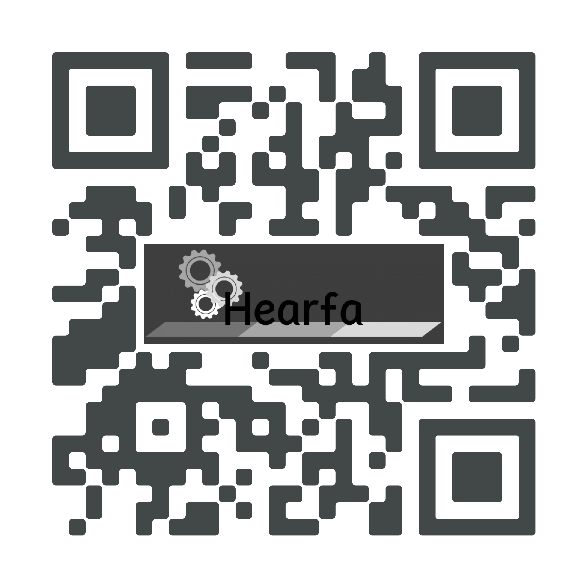

___
<!-- **Note: !** -->
Actuality these days with coronavirus stop a lot of business,some of them are a government, company, or even citizens.And their the hence of program idea started, Which is communicate on more than one side through one platform, And where the completion of operations faster and easier

The fact that the program is available and ensures that you can start using it immediately, and we believe that we have valuable suggestions that you can start and give you return on investment immediately, and this helps you to assign orders much more effciently, and get in touch with our support team to improve the strength the work.

Project demo
- [Project Document](Hearfa.pdf) 
- [Project video](https://www.youtube.com/watch?v=H_CI3yEDGTQ)
- [Visit Website](https://vex-xcc.github.io/hearfa_front-end)

___
- List of Technologies used :
  - Zoom
  - React App
  - React-router-dom
  - Axios
  - Local Storage
  - Bootstrap
  - Express
  - Mongoose
  - Passpor
  - Bcrypt
  - jwt
  - jwt-decode
  - Heroku
  - SweetAlert

#### References
- [API Docs](https://mongoosejs.com/docs/api.html)
- [SweetAlert](https://sweetalert.js.org/guides/)
- [Wireframes](https://www.draw.io/)

#### futeur work :
- As an customer, Able to uplode files to the services.
- Live chat.
- More responsive UI.

